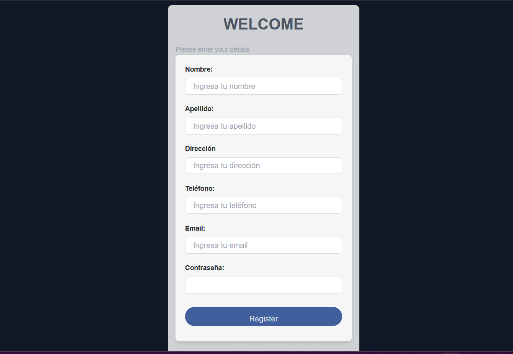
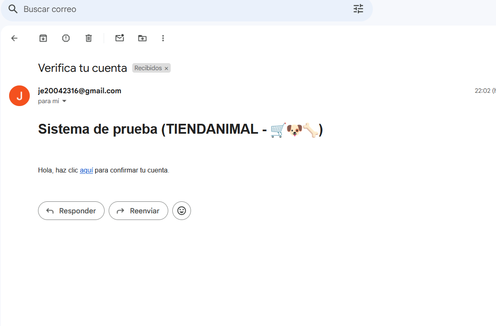
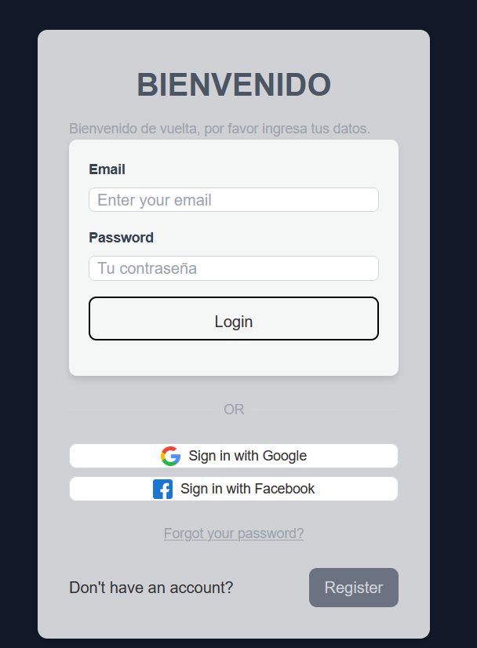

-- DESARROLLO DEL PROYECTO FRONTEND --

-- SPRINT 0 Configuración del ambiente de desarrollo --

- Delimitación de los requisitos a cumplir

- Estructura general de las carpetas del proyecto

- Asignación de roles para cada usuario

-- SPRINT 1 -- 

•	Consumo de endpoint para el registro.

•	Consumo de endpoint para el envío y verificación de email.

•	Consumo de endpoints para el restablecimiento de contraseña.

•	Consumo de endpoints para el inicio de sesión.

